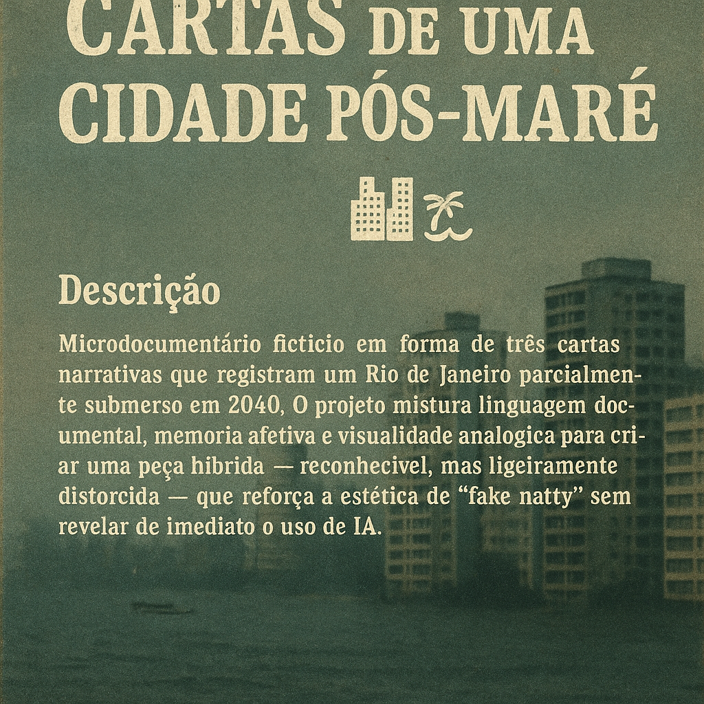
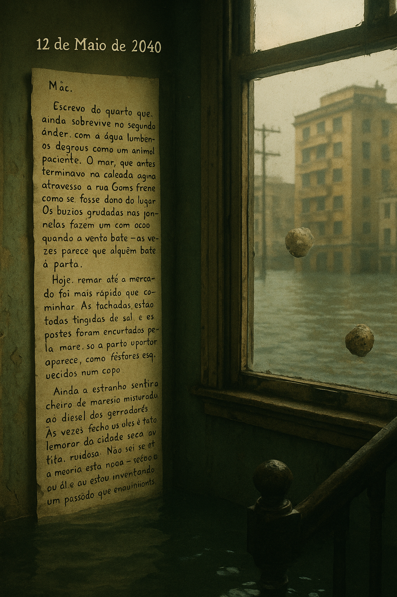
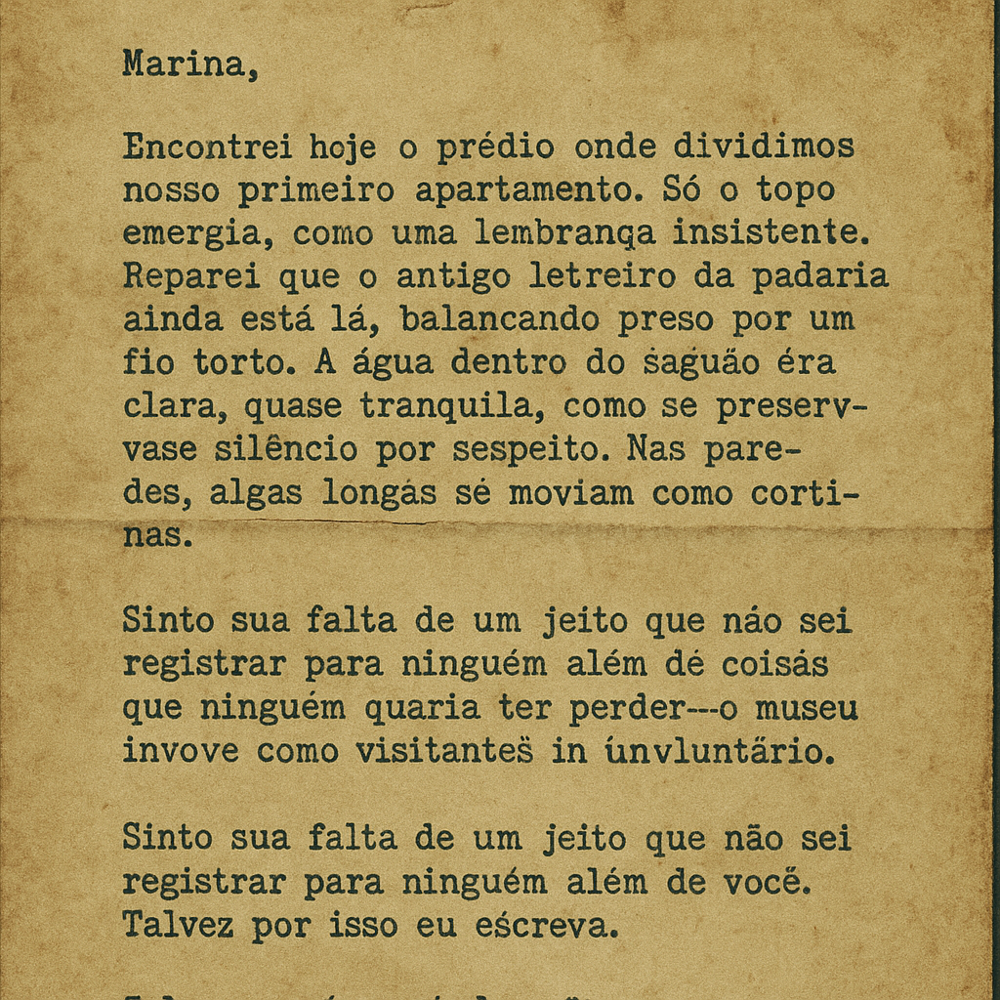
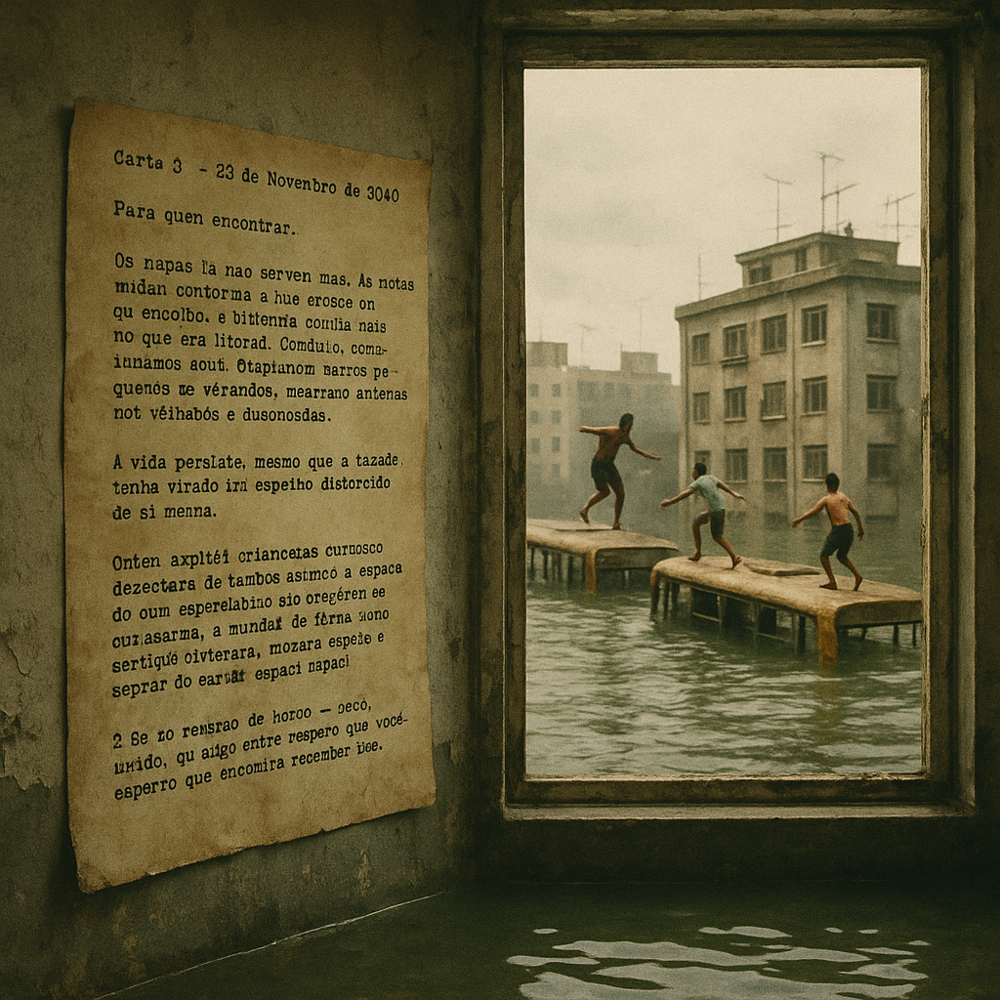

# Cartas de uma Cidade Pós-Maré 🌆🌊

## 📒 Descrição

Microdocumentário fictício em forma de três cartas narrativas que registram um Rio de Janeiro parcialmente submerso em 2040. O projeto mistura linguagem documental, memória afetiva e visualidade analógica para criar uma peça híbrida — reconhecível, mas ligeiramente distorcida — que reforça a estética de “fake natty” sem revelar de imediato o uso de IA.

---

## 📜 Cartas — Script Final (~420 palavras)

### Carta 1 — 12 de Maio de 2040

Mãe,
Escrevo do quarto que ainda sobrevive no segundo andar, com a água lambendo os degraus como um animal paciente. O mar, que antes terminava na calçada, agora atravessa a rua Gomes Freire como se fosse dono do lugar. Os búzios grudados nas janelas fazem um som oco quando o vento bate — às vezes parece que alguém bate à porta.
Hoje, remar até o mercado foi mais rápido que caminhar. As fachadas estão todas tingidas de sal, e os postes foram encurtados pela maré; só a parte superior aparece, como fósforos esquecidos num copo.
Ainda é estranho sentir o cheiro de maresia misturado ao diesel dos geradores. Às vezes fecho os olhos e tento lembrar da cidade seca, quente, ruidosa. Não sei se a memória está apagando ou se eu é que estou inventando um passado que conforta.
Volto a escrever quando a água baixar — se baixar.

---

### Carta 2 — 3 de Agosto de 2040

Marina,
Encontrei hoje o prédio onde dividimos nosso primeiro apartamento. Só o topo emergia, como uma lembrança insistente. Reparei que o antigo letreiro da padaria ainda está lá, balançando preso por um fio torto.
Desci do barco e nadei até a entrada. A água dentro do saguão era clara, quase tranquila, como se preservasse silêncio por respeito. Nas paredes, algas longas se moviam como cortinas. Toquei o corrimão da escada e, por um segundo, juro que senti o cheiro do café que você preparava nas manhãs de domingo.
A cidade inteira virou uma cápsula de coisas que ninguém quis perder — ou não teve tempo. As pessoas se movem como visitantes de um museu involuntário.
Sinto sua falta de um jeito que não sei registrar para ninguém além de você. Talvez por isso eu escreva. Talvez por isso ainda volte.

---

### Carta 3 — 29 de Novembro de 2040

Para quem encontrar,
Os mapas já não servem mais. As rotas mudam conforme a lua cresce ou encolhe, e ninguém confia mais no que era litoral. Contudo, continuamos aqui. Adaptamos barcos pequenos às varandas, amarramos antenas nos telhados e fazemos fogueiras em lajes que viraram ilhas improvisadas.
A vida persiste, mesmo que a cidade tenha virado um espelho distorcido de si mesma.
Ontem avistei crianças brincando de pular de um ônibus submerso para outro, como se fosse um parque aquático feito pela própria maré. Riam de um jeito que anulava qualquer tragédia.
Se um dia estas cartas chegarem a mãos curiosas, que sirvam como registro: não desaparecemos. Apenas mudamos de forma, como tudo que tenta sobreviver.
E se o Rio renascer de novo — seco, úmido ou algo entre os dois — espero que encontre espaço para lembrar de nós.
